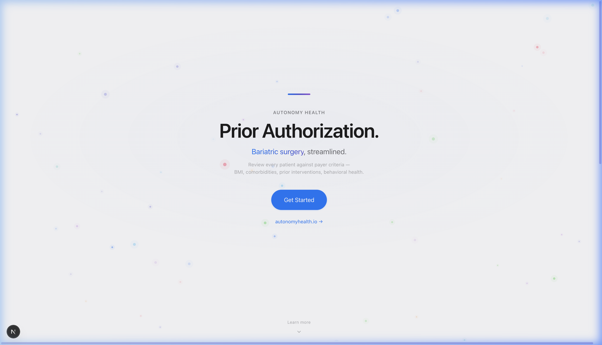
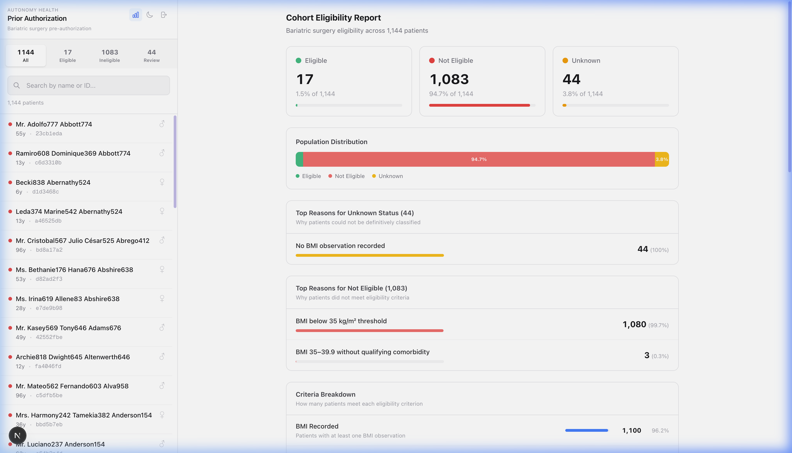
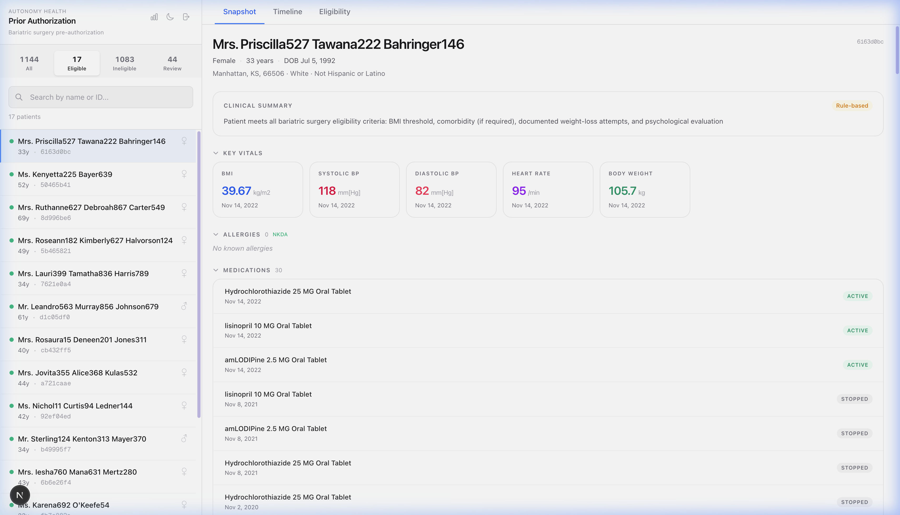
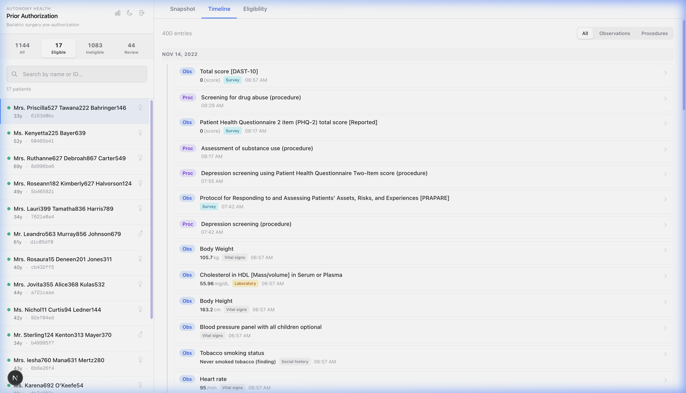
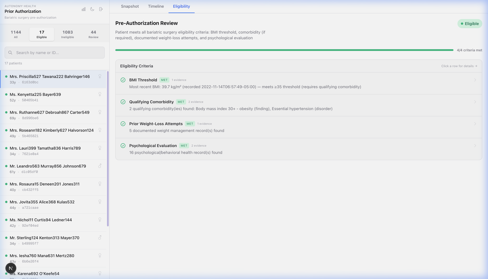
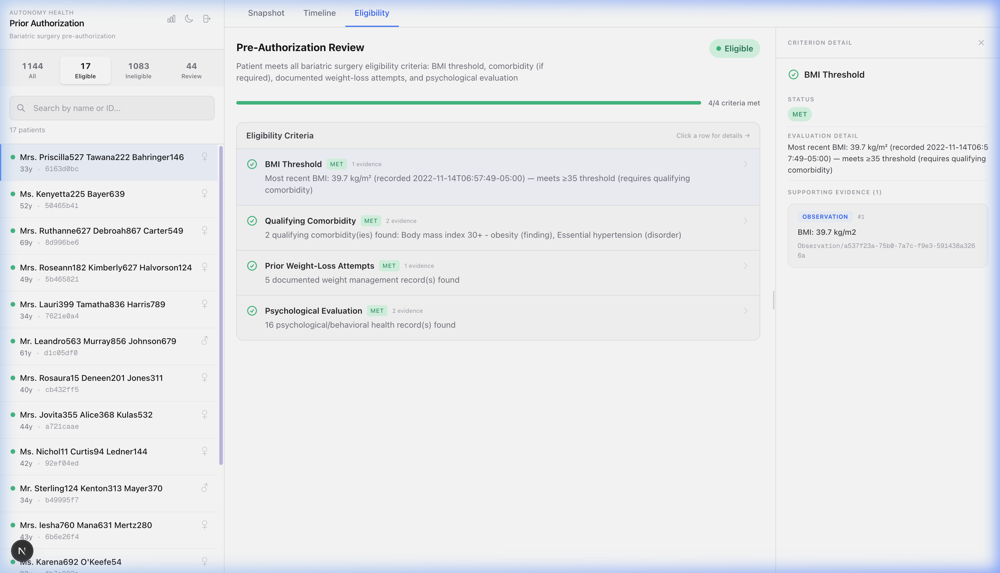

# Autonomy Health Assessment — Prior Auth Review Tool

A clinician-facing prior authorization review tool for bariatric surgery eligibility. Built with **Next.js**, **TypeScript**, **Prisma**, and **SQLite** over FHIR R4 patient data.

---

## Quick Start

```bash
cd autonomy-health
npm install
npx prisma generate
npm run dev
```

Open [http://localhost:3000](http://localhost:3000)

> If `fhir_data.db` doesn't exist yet, regenerate it first:
> ```bash
> python3 data/convert_to_sqlite.py
> ```

---

## Product Overview

The app provides five core capabilities for bariatric surgery pre-authorization review:

| Capability | Description |
|---|---|
| **Patient Panel** | Searchable sidebar with 1,144 patients, filterable by eligibility status |
| **Clinical Snapshot** | Demographics, conditions, vitals (BMI, BP, HR, weight), medications, allergies, encounters |
| **Patient Timeline** | Chronological observations + procedures with FHIR resource IDs, category badges, cursor-based pagination |
| **Eligibility Engine** | Deterministic 4-criterion evaluation: BMI, comorbidity, weight-loss history, psych evaluation |
| **Cohort Analytics** | Population-level eligibility distribution, top disqualifiers, criteria breakdown |
| **AI-Assisted Review** | OpenAI o3-powered structured clinical summaries with FHIR-grounded evidence |

### Screenshots

#### Welcome Screen


#### Cohort Eligibility Report


#### Clinical Snapshot


#### Patient Timeline


#### Eligibility Panel


#### Eligibility Detail — FHIR Evidence


---

## Architecture

### Technology Stack

| Layer | Technology |
|---|---|
| **Framework** | Next.js 15 (App Router) |
| **Language** | TypeScript (strict) |
| **ORM** | Prisma with `@prisma/adapter-better-sqlite3` |
| **Database** | SQLite (~2.5 GB single file `fhir_data.db`) |
| **AI** | OpenAI o3 via REST API |
| **Styling** | Tailwind CSS + inline styles (Apple-inspired design system) |

### Project Structure

```
autonomy-health/
├── src/
│   ├── app/
│   │   ├── page.tsx                          # Main page: Welcome screen + Portal
│   │   └── api/
│   │       ├── patients/route.ts             # GET — list, search, eligibility filter
│   │       ├── patients/[id]/route.ts        # GET — clinical snapshot (12 resource types)
│   │       ├── patients/[id]/timeline/       # GET — cursor-based paginated timeline
│   │       ├── patients/[id]/eligibility/    # GET — deterministic eligibility evaluation
│   │       ├── patients/[id]/ai-review/      # POST — AI-assisted structured review
│   │       ├── cohort/report/               # GET — population-level eligibility report
│   │       └── eligibility/batch/           # GET — batch eligibility for patient list
│   ├── components/
│   │   ├── PatientList.tsx      # Sidebar: search, filter, pagination (50/page)
│   │   ├── ClinicalSnapshot.tsx # Demographics, conditions, vitals, meds, encounters (1,179 lines)
│   │   ├── Timeline.tsx         # Chronological view with type/category filtering
│   │   ├── EligibilityPanel.tsx # Criteria list + resizable 3-pane detail panel
│   │   └── CohortReport.tsx     # Dashboard: stat cards, distribution bar, reasons
│   ├── lib/
│   │   ├── db.ts                # Prisma client singleton with SQLite adapter
│   │   ├── eligibility.ts      # Deterministic 4-criterion eligibility engine (364 lines)
│   │   └── fhir-parsers.ts     # FHIR R4 → TypeScript summary transforms
│   └── types/
│       └── fhir.ts              # TypeScript types for FHIR + API responses (305 lines)
├── prisma/schema.prisma         # Database schema (16 tables)
├── data/
│   ├── fhir_data.db             # SQLite database (generated, ~2.5 GB — gitignored)
│   ├── convert_to_sqlite.py     # ETL migration script
│   ├── FHIR_DATA_GUIDE.md       # Detailed data documentation
│   └── raw-data/               # Source NDJSON files (~1.6 GB)
└── tests/                       # Migration verification tests
```

### Data Flow

```
Synthea Generator
    → raw-data/ (46 NDJSON files, 1.6 GB)
        → convert_to_sqlite.py (ETL)
            → fhir_data.db (SQLite, 2.5 GB, 16 tables)
                → Prisma + json_extract (API routes)
                    → React Components (client)
                    → OpenAI o3 (AI review)
```

### API Endpoints

| Method | Route | Purpose |
|---|---|---|
| `GET` | `/api/patients` | List / search patients with eligibility filter, 50/page |
| `GET` | `/api/patients/:id` | Clinical snapshot (12 resource types) |
| `GET` | `/api/patients/:id/timeline` | Cursor-based paginated timeline |
| `GET` | `/api/patients/:id/eligibility` | Deterministic eligibility evaluation |
| `POST` | `/api/patients/:id/ai-review` | AI-assisted structured review |
| `GET` | `/api/cohort/report` | Population-level eligibility report |
| `GET` | `/api/eligibility/batch` | Batch eligibility for sidebar coloring |

---

## Data Management — ETL Process

### Source Data

| Property | Value |
|---|---|
| **Generator** | [Synthea](https://github.com/synthetichealth/synthea) synthetic patient generator |
| **FHIR Version** | R4 (US Core profiles) |
| **Format** | NDJSON (Newline-Delimited JSON) |
| **Patients** | 1,144 |
| **Total Records** | ~1,380,000 across 16 resource types |
| **Raw Size** | ~1.6 GB (46 files with multi-shard splits) |

### Resource Types

| Resource | Records | Key Fields |
|---|---|---|
| **Patient** | 1,144 | `name`, `gender`, `birthDate`, `address`, `race`, `ethnicity` |
| **Observation** | 693,523 | LOINC codes, `valueQuantity`, `effectiveDateTime` |
| **DiagnosticReport** | 160,349 | LOINC codes, base64 clinical notes |
| **Procedure** | 136,515 | SNOMED codes, `performedPeriod` |
| **MedicationRequest** | 95,059 | RxNorm codes, `status`, `authoredOn` |
| **Encounter** | 87,244 | Type, class, period |
| **DocumentReference** | 87,244 | LOINC type, base64 content |
| **Condition** | 45,540 | SNOMED codes, `clinicalStatus`, `onsetDateTime` |
| **Immunization** | 17,366 | Vaccine codes, `occurrenceDateTime` |
| **Device** | 2,341 | SNOMED types, UDI carriers |
| **AllergyIntolerance** | 835 | RxNorm codes, reactions |

### ETL Pipeline (`convert_to_sqlite.py`)

1. **Discover** all `.ndjson` files in `raw-data/`
2. **Create one table per resource type** — `(id TEXT PK, data JSON)` schema
3. **Parse line-by-line**, extract `id`, batch `INSERT OR REPLACE` in groups of 5,000
4. **Create expression indexes** on `json_extract` paths for fast lookups
5. **~2 min execution** — no external Python dependencies (stdlib only)

### Database Schema

Every FHIR resource type maps to one table with two columns:

```sql
CREATE TABLE {ResourceType} (
    id   TEXT PRIMARY KEY,   -- FHIR resource UUID
    data JSON                -- Full original JSON record
);
```

16 tables: `Patient`, `Condition`, `Observation`, `Procedure`, `Encounter`, `MedicationRequest`, `DiagnosticReport`, `DocumentReference`, `Immunization`, `AllergyIntolerance`, `Device`, `Organization`, `Location`, `Practitioner`, `PractitionerRole`, `log`

### FHIR Reference Resolution

All clinical resources link to a Patient via `subject.reference` or `patient.reference`:

```
Patient
 ├── Condition          → subject.reference
 ├── Observation        → subject.reference
 ├── Encounter          → subject.reference
 ├── Procedure          → subject.reference
 ├── MedicationRequest  → subject.reference
 ├── DiagnosticReport   → subject.reference
 ├── DocumentReference  → subject.reference
 ├── Immunization       → patient.reference
 ├── AllergyIntolerance → patient.reference
 └── Device             → patient.reference
```

Joined via: `json_extract(data, '$.subject.reference') = 'Patient/' || p.id`

### Coding Systems

| System | URI | Used For | Example |
|---|---|---|---|
| **SNOMED CT** | `http://snomed.info/sct` | Conditions, Procedures | `44054006` = Type 2 diabetes |
| **LOINC** | `http://loinc.org` | Observations, Reports | `39156-5` = BMI |
| **RxNorm** | `http://www.nlm.nih.gov/research/umls/rxnorm` | Medications, Allergies | `205923` = Epoetin Alfa |

---

## Data Structures & Type System

The type system in `types/fhir.ts` is organized in three layers:

**Layer 1 — Raw FHIR shapes** (parsed from JSON):
`FhirCoding`, `FhirCodeableConcept`, `FhirReference`, `FhirPatient`, `FhirCondition`, `FhirObservation`, `FhirProcedure`

**Layer 2 — API response summaries** (UI-ready transforms):
`PatientDetail`, `ConditionSummary`, `ObservationSummary`, `ProcedureSummary`, `MedicationSummary`, `AllergySummary`, `EncounterSummary`, `DiagnosticReportSummary`, `ClinicalSnapshot`

**Layer 3 — Domain types** (eligibility + AI):
```typescript
EligibilityStatus = "eligible" | "not_eligible" | "unknown"
CriterionStatus = "met" | "unmet" | "unknown"
EligibilityCriterion { name, status, detail, evidence[] }
EligibilityResult { status, summary, criteria[], unknownReasons[] }
AIReviewResult { clinicalSummary, eligibilityAssessment, checklist[], 
                 recommendedNextSteps[], source: "ai" | "fallback" }
```

---

## Eligibility Engine

### Algorithm (`lib/eligibility.ts`)

The engine evaluates 4 independent criteria, then computes a deterministic 3-way classification:

| # | Criterion | Data Source | Logic |
|---|---|---|---|
| 1 | **BMI Threshold** | Latest `Observation` with LOINC `39156-5` | ≥40 (standalone) or ≥35 (with comorbidity) |
| 2 | **Qualifying Comorbidity** | `Condition` with SNOMED codes | Skipped if BMI ≥ 40; required if BMI 35–39.9 |
| 3 | **Prior Weight-Loss Attempts** | `Procedure` + `DiagnosticReport` keyword search | 12 keywords: "weight management", "diet", "behavioral therapy", etc. |
| 4 | **Psychological Evaluation** | `Procedure` + `DiagnosticReport` keyword search | 9 keywords: "depression screening", "PHQ-2/9", "mental health", etc. |

### Classification Logic

```
IF BMI unmet OR comorbidity unmet → NOT ELIGIBLE
IF all 4 criteria MET → ELIGIBLE
IF clinical criteria met but documentation missing → UNKNOWN (with reasons)
ELSE → UNKNOWN (with reasons)
```

### Comorbidity SNOMED Codes

| Code | Condition |
|---|---|
| `59621000` | Essential hypertension |
| `44054006` | Type 2 diabetes mellitus |
| `73430006` | Sleep apnea |
| `162864005` | Obesity (BMI 30+) |
| `399211009` / `22298006` | Myocardial infarction |
| `698271000` / `414545008` | Coronary / Ischemic heart disease |

### Cohort Results

| Category | Count | Percentage |
|---|---|---|
| **Eligible** | 17 | 1.5% |
| **Not Eligible** | 1,083 | 94.7% |
| **Unknown** | 44 | 3.8% |
| **Total** | 1,144 | 100% |

Top unknown reason: "No BMI observation recorded" (44 patients, 100% of unknowns)

---

## AI-Assisted Review

### How It Works

1. `POST /api/patients/:id/ai-review` triggers the review
2. **Deterministic eligibility** is evaluated first via Part C engine
3. **Patient context** is gathered — conditions, observations, medications, procedures
4. **Structured prompt** sent to OpenAI o3 with all FHIR context
5. **Grounding validation** — `validateGrounding()` filters evidence to only valid FHIR resource IDs
6. **Eligibility override** — `eligibilityAssessment` always replaced with deterministic result
7. Returns `AIReviewResult` with `source: "ai"`

### Hard Constraints

| Constraint | Implementation |
|---|---|
| **Grounding** | Every claim must reference a valid FHIR resource ID or be marked unknown |
| **Determinism boundary** | AI cannot override Part C eligibility status |
| **Failure handling** | API error / bad JSON → `buildFallback()` returns deterministic result as `source: "fallback"` |
| **No silent inference** | System prompt forbids "likely", "probably", "implied" without evidence |

---

## Performance Optimizations

### Technique: SQLite Expression Indexes on `json_extract` Fields

**26 expression indexes** target the dominant bottleneck — correlated subqueries over deeply nested JSON fields in a 2.5 GB database.

#### 1. Reference Indexes (10) — Link Resources → Patient

Every per-patient query joins on `subject.reference` or `patient.reference`. These are the foundation.

| Index | Table | Indexed Expression |
|---|---|---|
| `idx_Condition_subject` | Condition | `json_extract(data, '$.subject.reference')` |
| `idx_Observation_subject` | Observation | `json_extract(data, '$.subject.reference')` |
| `idx_Encounter_subject` | Encounter | `json_extract(data, '$.subject.reference')` |
| `idx_Procedure_subject` | Procedure | `json_extract(data, '$.subject.reference')` |
| `idx_MedicationRequest_subject` | MedicationRequest | `json_extract(data, '$.subject.reference')` |
| `idx_DiagnosticReport_subject` | DiagnosticReport | `json_extract(data, '$.subject.reference')` |
| `idx_DocumentReference_subject` | DocumentReference | `json_extract(data, '$.subject.reference')` |
| `idx_Immunization_patient` | Immunization | `json_extract(data, '$.patient.reference')` |
| `idx_AllergyIntolerance_patient` | AllergyIntolerance | `json_extract(data, '$.patient.reference')` |
| `idx_Device_patient` | Device | `json_extract(data, '$.patient.reference')` |

#### 2. Observation Indexes (6) — BMI, Vitals, Timeline

The Observation table (693K rows) is the most queried. These indexes speed up `getLatestBMI()`, vitals charting, and the observations API.

| Index | Indexed Expression(s) | Query Pattern It Speeds Up |
|---|---|---|
| `idx_obs_subject` | `$.subject.reference` | `WHERE subject = ?` |
| `idx_obs_code` | `$.code.coding[0].code` | `WHERE code = '39156-5'` (BMI by LOINC) |
| `idx_obs_date` | `$.effectiveDateTime` | `ORDER BY date DESC` |
| `idx_obs_category` | `$.category[0].coding[0].display` | Filter by observation category |
| `idx_obs_subject_code` | `$.subject.reference` + `$.code.coding[0].code` | `WHERE subject = ? AND code = ?` |
| `idx_obs_subject_code_date` | `$.subject.reference` + `$.code.coding[0].code` + `$.effectiveDateTime` | `WHERE subject = ? AND code = ? ORDER BY date DESC LIMIT 1` — **the #1 hot path** (BMI lookup) |

#### 3. Condition Indexes (3) — Comorbidity Check

Used by `getActiveComorbidities()` in the eligibility engine to find hypertension, T2DM, sleep apnea.

| Index | Indexed Expression(s) | Query Pattern It Speeds Up |
|---|---|---|
| `idx_cond_subject` | `$.subject.reference` | `WHERE subject = ?` |
| `idx_cond_subject_status_code` | `$.subject.reference` + `$.clinicalStatus...code` + `$.code...code` | `WHERE subject = ? AND status = 'active' AND code IN (...)` |
| `idx_cond_subject_status_code2` | `$.subject.reference` + `$.clinicalStatus...code` + `$.code...code` | Same pattern, alternate index for query planner |

#### 4. Procedure Indexes (3) — Weight-Loss & Psych Eval Search

Used by `findDocumentation()` to search for weight-loss attempts and psychological evaluations via `LIKE '%keyword%'` on procedure display names.

| Index | Indexed Expression(s) | Query Pattern It Speeds Up |
|---|---|---|
| `idx_proc_subject` | `$.subject.reference` | `WHERE subject = ?` |
| `idx_proc_display` | `LOWER($.code.coding[0].display)` | `WHERE LOWER(display) LIKE '%weight%'` |
| `idx_proc_subject_display` | `$.subject.reference` + `LOWER($.code.coding[0].display)` | `WHERE subject = ? AND LOWER(display) LIKE '%keyword%'` |

#### 5. DiagnosticReport Indexes (2) — Documentation Keyword Search

Same keyword search pattern as Procedures, across 160K DiagnosticReport records.

| Index | Indexed Expression(s) | Query Pattern It Speeds Up |
|---|---|---|
| `idx_diag_subject` | `$.subject.reference` | `WHERE subject = ?` |
| `idx_diag_subject_display` | `$.subject.reference` + `LOWER($.code.coding[0].display)` | `WHERE subject = ? AND LOWER(display) LIKE '%keyword%'` |

#### 6. Patient Indexes (2) — Name Search & Sorting

Used by `GET /patients?search=...` for the sidebar patient list with search and alphabetical sorting.

| Index | Indexed Expression | Query Pattern It Speeds Up |
|---|---|---|
| `idx_patient_family` | `$.name[0].family` | `WHERE family LIKE ?` + `ORDER BY family ASC` |
| `idx_patient_given` | `$.name[0].given[0]` | `WHERE given LIKE ?` + `ORDER BY given ASC` |

### Results

| Query | Before | After | Speedup |
|---|---|---|---|
| Eligibility filter (single patient) | 5.6s | 0.26s | **22×** |
| Batch eligibility (all patients) | 3.0s | 0.96s | **3×** |

### Why This Was the Right Optimization

Every eligibility check scans 693K observations (BMI lookup), 45K conditions (comorbidity match), and 296K procedures+reports (keyword search). Without indexes, each `json_extract` requires a full table scan. Expression indexes build B-trees on extracted values → O(log N) lookups.

---

## Querying the Database

All data lives in SQLite as JSON blobs, queried with `json_extract()`. Connect via:

```bash
sqlite3 data/fhir_data.db
```

### Common Patterns

**Get a patient's name and demographics:**
```sql
SELECT json_extract(data, '$.name[0].given[0]') AS first_name,
       json_extract(data, '$.name[0].family')    AS last_name,
       json_extract(data, '$.gender')             AS gender,
       json_extract(data, '$.birthDate')          AS dob
FROM Patient WHERE id = '<patient-uuid>';
```

**Get all active conditions for a patient:**
```sql
SELECT json_extract(data, '$.code.coding[0].display') AS condition,
       json_extract(data, '$.code.coding[0].code')    AS snomed_code,
       json_extract(data, '$.onsetDateTime')           AS onset
FROM Condition
WHERE json_extract(data, '$.subject.reference') = 'Patient/<uuid>'
  AND json_extract(data, '$.clinicalStatus.coding[0].code') = 'active';
```

**Get the latest BMI reading:**
```sql
SELECT json_extract(data, '$.valueQuantity.value') AS bmi,
       json_extract(data, '$.effectiveDateTime')    AS date
FROM Observation
WHERE json_extract(data, '$.subject.reference') = 'Patient/<uuid>'
  AND json_extract(data, '$.code.coding[0].code') = '39156-5'
ORDER BY json_extract(data, '$.effectiveDateTime') DESC
LIMIT 1;
```

**Find patients with qualifying comorbidities (hypertension, T2DM, sleep apnea):**
```sql
SELECT DISTINCT REPLACE(json_extract(data, '$.subject.reference'), 'Patient/', '') AS patient_id,
       json_extract(data, '$.code.coding[0].display') AS condition
FROM Condition
WHERE json_extract(data, '$.clinicalStatus.coding[0].code') = 'active'
  AND json_extract(data, '$.code.coding[0].code') IN (
      '59621000',  -- Hypertension
      '44054006',  -- Type 2 Diabetes
      '73430006'   -- Sleep Apnea
  );
```

**Get all procedures for a patient (chronological):**
```sql
SELECT json_extract(data, '$.code.coding[0].display') AS name,
       json_extract(data, '$.performedPeriod.start')   AS date,
       json_extract(data, '$.status')                   AS status
FROM "Procedure"
WHERE json_extract(data, '$.subject.reference') = 'Patient/<uuid>'
ORDER BY date DESC;
```

**Cohort analysis — all patients with BMI ≥ 40:**
```sql
SELECT p.id,
       json_extract(p.data, '$.name[0].given[0]') AS name,
       o.bmi
FROM Patient p
JOIN (
    SELECT json_extract(data, '$.subject.reference') AS ref,
           json_extract(data, '$.valueQuantity.value') AS bmi,
           ROW_NUMBER() OVER (
               PARTITION BY json_extract(data, '$.subject.reference')
               ORDER BY json_extract(data, '$.effectiveDateTime') DESC
           ) AS rn
    FROM Observation
    WHERE json_extract(data, '$.code.coding[0].code') = '39156-5'
) o ON o.ref = 'Patient/' || p.id AND o.rn = 1
WHERE o.bmi >= 40;
```

### Key LOINC Codes (Observations)

| Code | Measurement |
|---|---|
| `39156-5` | BMI |
| `8480-6` | Systolic Blood Pressure |
| `8462-4` | Diastolic Blood Pressure |
| `8867-4` | Heart Rate |
| `29463-7` | Body Weight |

### In Application Code (via Prisma)

Since Prisma doesn't natively support `json_extract`, queries use `$queryRawUnsafe`:

```typescript
const bmi = await prisma.$queryRawUnsafe<{ value: number; date: string }[]>(
    `SELECT json_extract(data, '$.valueQuantity.value') AS value,
            json_extract(data, '$.effectiveDateTime')    AS date
     FROM Observation
     WHERE json_extract(data, '$.subject.reference') = ?
       AND json_extract(data, '$.code.coding[0].code') = '39156-5'
     ORDER BY date DESC LIMIT 1`,
    `Patient/${patientId}`
);
```

### How `json_extract` Works Under the Hood

SQLite's `json_extract()` is a **scalar function** that parses a JSON text value and navigates a [JSON path](https://www.sqlite.org/json1.html) at query time. When you write:

```sql
SELECT json_extract(data, '$.subject.reference') FROM Observation;
```

Here's what happens on each row:

1. **Parse** — SQLite tokenizes the `data` TEXT column into an in-memory JSON tree
2. **Navigate** — walks the path `$ → subject → reference` through object keys
3. **Extract** — returns the leaf value as a SQLite type (TEXT, INTEGER, REAL, or NULL)

This is a **runtime operation** — without indexes, every query scans all rows and parses every JSON blob. On 693K Observations (~500 MB of JSON), a naive BMI lookup takes **5.6 seconds**.

#### Expression Indexes: The Key Optimization

SQLite supports **indexes on expressions**, not just columns. The ETL script creates 26 indexes across six categories:

```sql
-- Reference indexes (10): link resources to patients
CREATE INDEX idx_Observation_subject ON Observation(json_extract(data, '$.subject.reference'));
CREATE INDEX idx_Immunization_patient ON Immunization(json_extract(data, '$.patient.reference'));

-- Code indexes (3): speed up LOINC/SNOMED lookups
CREATE INDEX idx_Observation_code ON Observation(json_extract(data, '$.code.coding[0].code'));

-- Clinical status (1): filter active conditions
CREATE INDEX idx_Condition_clinicalStatus ON Condition(json_extract(data, '$.clinicalStatus.coding[0].code'));

-- Date indexes (2): support ORDER BY and range queries
CREATE INDEX idx_Observation_date ON Observation(json_extract(data, '$.effectiveDateTime'));
```

SQLite pre-computes `json_extract(...)` for every row and stores the results in a **B-tree index**. Now when a `WHERE` clause uses the same expression, SQLite recognizes it and does an **O(log N) index lookup** instead of a full table scan:

```
Without index:  Scan 693K rows → parse JSON → filter  →  5.6s
With index:     B-tree lookup → 1-2 rows returned      →  0.26s  (22× faster)
```

#### Why `json_extract` Over Other Approaches?

| Alternative | Why we didn't use it |
|---|---|
| **Generated columns** | SQLite supports `AS (json_extract(...)) STORED`, but these inflate table size by duplicating data and require schema changes per field |
| **Materialized views** | SQLite doesn't support materialized views natively — would need manual refresh triggers |
| **Application-level parsing** | Moves filtering to Node.js — would need to load all rows into memory, defeating the purpose of a database |
| **Denormalized columns** | Adding `subject_ref TEXT` columns during ETL would work, but loses the elegance of schema-agnostic tables and complicates the ETL script |

**`json_extract` + expression indexes** gives us the best of both worlds: the simplicity of storing raw FHIR JSON (one table, two columns) with the query performance of a fully indexed relational schema.

### Why This Approach? Comparison with Alternatives

| Approach | Advantages | Disadvantages |
|---|---|---|
| **JSON-in-SQLite** *(chosen)* | • Zero infrastructure — single `fhir_data.db` file, no server needed<br>• Preserves original FHIR format — no data loss from schema mapping<br>• Fast ETL (~2 min, stdlib Python only)<br>• Expression indexes make queries fast (22× speedup)<br>• Schema-agnostic — new resource types need zero schema changes | • Queries are verbose (`json_extract` everywhere)<br>• No type safety at the SQL layer<br>• Harder to do complex JOINs across deeply nested JSON<br>• DB file is large (2.5 GB) since JSON is stored verbatim |
| **Fully Normalized Relational** (one column per field) | • Clean SQL with typed columns<br>• Standard JOINs, foreign keys, constraints<br>• Smaller DB size (no repeated JSON keys)<br>• Full type safety at the DB layer | • Complex ETL — must map every FHIR field to a column<br>• Schema changes needed for each new resource type<br>• Lossy — rarely-used FHIR fields get dropped or ignored<br>• FHIR's polymorphic fields (value[x]) are awkward to model |
| **PostgreSQL + JSONB** | • Binary JSON — faster parsing than SQLite text JSON<br>• GIN indexes on JSON paths are more flexible<br>• `@>` containment operator for elegant queries<br>• Better concurrency for multi-user apps | • Requires running a PostgreSQL server<br>• Heavier deployment (Docker/managed DB)<br>• Overkill for a single-user review tool<br>• More complex local development setup |
| **FHIR Server** (HAPI, etc.) | • Purpose-built for FHIR — native search parameters<br>• Standard REST API (`/Patient?name=...`)<br>• Built-in validation and conformance<br>• Handles references, includes, and revIncludes natively | • Heavy infrastructure (Java server + database)<br>• Slow to ingest large datasets<br>• Complex to customize for non-standard queries<br>• Significant learning curve and operational overhead |

**Bottom line**: For a single-user clinician review tool processing synthetic data, JSON-in-SQLite hits the sweet spot — zero deployment overhead, fast queries with expression indexes, and no information loss from the source FHIR records.

### Industry Tools Using the Same Pattern

The `json_extract` approach isn't just a local hack — it's how major cloud platforms handle FHIR data at scale:

| Tool / Platform | JSON Query Function | How It Handles FHIR |
|---|---|---|
| **AWS HealthLake + Athena** | `json_extract()` (Trino/Presto) | Stores FHIR resources in Apache Iceberg tables. Queries use `json_extract` on nested fields like `extension[1]` and joins via `CONCAT('Patient/', patient.id) = condition.subject.reference` — [identical to our pattern](https://docs.aws.amazon.com/healthlake/latest/devguide/integrating-athena-complex-filtering.html) |
| **Google Cloud Healthcare API + BigQuery** | `JSON_EXTRACT()` / dot notation | Exports FHIR stores to BigQuery, flattening nested JSON into queryable tables. Supports streaming sync for near real-time analytics |
| **Snowflake** | `VARIANT` column + `FLATTEN()` | Stores FHIR JSON in `VARIANT` columns (similar to our `TEXT` + `json_extract`). Uses `LATERAL FLATTEN` to unnest arrays like `coding[]` and `extension[]` |
| **Azure SQL / SQL Server** | `JSON_VALUE()` / `OPENJSON()` | `JSON_VALUE` extracts scalar values (like our `json_extract`). `OPENJSON` expands arrays into rows for tabular analysis |
| **PostgreSQL (Fhirbase / Aidbox)** | `JSONB` + `@>` / `->>` operators | Purpose-built FHIR servers storing resources as `JSONB`. GIN indexes on JSON paths for fast containment queries. Most similar to our approach conceptually |
| **SQL on FHIR (emerging standard)** | ViewDefinition + SQL | HL7-backed specification for creating reusable tabular views from FHIR JSON. Aims to standardize what every platform above does ad-hoc |

**Key insight**: Every platform above stores FHIR as JSON and queries it with extraction functions — they just use different SQL dialects. Our SQLite + `json_extract` approach is the same fundamental pattern, optimized for local single-user use.

---

## Design

### Visual Language

- **Typography**: SF Pro font stack (`-apple-system, BlinkMacSystemFont, "SF Pro Display"`)
- **Colors**: System blue (`#007AFF`), semantic status colors (green = met, red = unmet, amber = unknown)
- **Layout**: Sidebar + main content + optional detail pane (3-pane with draggable resizer)
- **Dark mode**: Full dark theme toggle
- **Animations**: Particle canvas (55 pulsing particles), fade-up transitions, skeleton loading

### UX Patterns

- **Information hierarchy > visual polish** — data first, chrome second
- **Explicit missing data** — "—", "Unknown", "No known allergies (NKDA)"
- **Eligibility color dots** — green (eligible), red (not eligible), amber (review needed)
- **Clickable rows → detail panel** — evidence displayed in a resizable right pane

---

## Requirements Checklist

### Part A: Data Ingestion
| # | Requirement | Status | How |
|---|------------|--------|-----|
| 1 | Parse and normalize FHIR resources | ✅ | Raw NDJSON → SQLite DB (`fhir_data.db`) with per-resource tables. FHIR JSON stored as `data` column, parsed at query time via `json_extract`. |
| 2 | Correctly resolve references (e.g., Condition.subject → Patient) | ✅ | All queries join via `json_extract(data, '$.subject.reference') = 'Patient/' \|\| id`. |
| 3 | Group all resources by patient | ✅ | Resources queried per-patient using `subject.reference` field. |
| 4 | Safely handle missing or partial fields | ✅ | TypeScript optional fields, `??` fallbacks, UI shows "—" or "Unknown". |
| 5 | **Performance optimization** (mandatory) | ✅ | 26 SQLite expression indexes on `json_extract` fields. **Before:** 5.6s → **After:** 0.26s (22× speedup). |

### Part B: Frontend
| # | Requirement | Status | How |
|---|------------|--------|-----|
| 1 | Patient Selector — select by name or ID | ✅ | Searchable sidebar (`PatientList.tsx`) with debounced search, 50-patient pages. |
| 2 | Switching patients updates all views | ✅ | Selected patient ID flows from `page.tsx` → all tab components. |
| 3 | Clinical Snapshot — age, sex, conditions, procedures, observations | ✅ | `ClinicalSnapshotView` with demographics, conditions, vitals, medications, allergies, encounters. |
| 4 | Timeline — chronological observations + procedures | ✅ | `Timeline.tsx` merges Obs + Proc chronologically. Type badges, category pills, FHIR IDs, cursor pagination. |
| 5 | UX: Information hierarchy > visual polish | ✅ | Tab-based layout. Missing data shown explicitly. Semantic color coding. |

### Part C: Eligibility Logic & Cohort Report
| # | Requirement | Status | How |
|---|------------|--------|-----|
| 1 | BMI ≥ 40 OR BMI ≥ 35 + comorbidity | ✅ | `eligibility.ts` — queries latest BMI (LOINC 39156-5), checks comorbidities (8 SNOMED codes). |
| 2 | Required documentation: weight-loss attempts + psych eval | ✅ | Keyword search across Procedure/DiagnosticReport (12 + 9 keyword lists). |
| 3 | Classify each patient as eligible / not eligible / unknown | ✅ | Deterministic 3-way classification. Results: 17 eligible, 1,083 not eligible, 44 unknown. |
| 4 | Explain unknown reasons | ✅ | `unknownReasons[]` — e.g., "No BMI data available", "No documented psychological evaluation". |
| 5 | Cohort report: total, counts, percentages, top unknown reasons | ✅ | `GET /api/cohort/report` — stat cards, distribution bar, criteria breakdown, eligible patients table. |

### Part D: AI-Assisted Review
| # | Requirement | Status | How |
|---|------------|--------|-----|
| 1 | Structured JSON output with clinicalSummary, checklist, recommendedNextSteps | ✅ | `POST /api/patients/:id/ai-review` → OpenAI o3 with full patient context. |
| 2 | Grounding — every claim references FHIR resource IDs | ✅ | `validateGrounding()` filters to valid FHIR resource IDs. No invented IDs. |
| 3 | Determinism boundary — AI cannot override Part C logic | ✅ | `eligibilityAssessment` always overwritten with deterministic engine result. |
| 4 | Failure handling — graceful fallback to deterministic output | ✅ | On error → returns Part C result as AI review schema, `source: "fallback"`. |
| 5 | No silent inference | ✅ | System prompt forbids "likely/probably/implied". Missing data must be stated as unknown. |

---

## Key Files

| File | Purpose | Lines |
|---|---|---|
| `src/app/page.tsx` | Main SPA: Welcome screen + Portal shell | 543 |
| `src/lib/eligibility.ts` | Deterministic eligibility engine | 364 |
| `src/types/fhir.ts` | TypeScript type system (3 layers) | 305 |
| `src/components/ClinicalSnapshot.tsx` | Clinical data display (11 data categories) | 1,179 |
| `src/components/EligibilityPanel.tsx` | Criteria list + evidence detail | 458 |
| `src/components/Timeline.tsx` | Chronological view | 335 |
| `src/components/PatientList.tsx` | Searchable patient sidebar | 317 |
| `src/components/CohortReport.tsx` | Population dashboard | 292 |
| `src/app/api/patients/[id]/ai-review/route.ts` | AI review endpoint | 286 |
| `src/lib/fhir-parsers.ts` | FHIR → summary transforms | 118 |
| `data/convert_to_sqlite.py` | ETL migration script | 107 |
| `prisma/schema.prisma` | Database schema (16 tables) | 126 |
| `src/lib/db.ts` | Prisma client singleton | 21 |

---

*This application is a technical assessment demonstrating automated prior authorization review for bariatric surgery candidates. Patient records are synthetically generated using Synthea and do not represent real individuals.*
